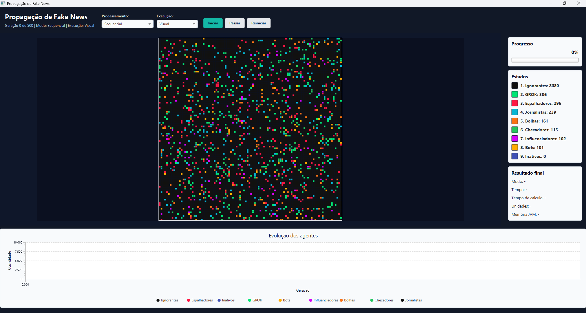
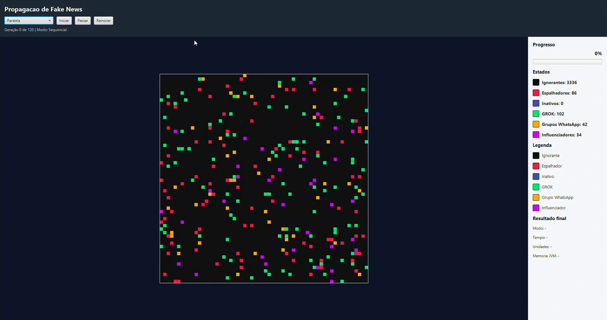

# Projeto Fake News em Sistemas Paralelos e Distribuidos


Projeto academico simples em Java para simular a propagacao de fake news em uma populacao representada por uma matriz bidimensional.

## Tema

Cada posicao da matriz representa uma pessoa. Os estados possiveis sao:

- `IGNORANT`: ainda nao recebeu/acredita na informacao.
- `SPREADER`: acredita e compartilha a informacao.
- `INACTIVE`: recebeu a informacao, mas nao compartilha mais.
- `GROK`: agente verificador que combate a fake news, mas pode ser corrompido raramente.
- `WHATSAPP_GROUP`: grupo ativo que amplia a propagacao ao redor.
- `INFLUENCER`: perfil de grande alcance que amplia ainda mais a propagacao.

A simulacao acontece em geracoes discretas. Em cada geracao, o programa le a matriz atual (`currentGrid`) e escreve o resultado na proxima matriz (`nextGrid`). Isso evita que uma celula atualizada no inicio da varredura influencie outra celula na mesma geracao.

## Regras da simulacao

- A vizinhanca usada e a de Moore: ate 8 vizinhos ao redor de uma celula.
- Uma pessoa `IGNORANT` pode virar `SPREADER` se tiver pelo menos um vizinho `SPREADER`, usando uma probabilidade configuravel.
- Uma pessoa `SPREADER` pode virar `INACTIVE`, mas tambem pode continuar espalhando por mais geracoes.
- Uma pessoa `INACTIVE` permanece `INACTIVE`.
- Uma pessoa `GROK` representa uma IA verificadora que reduz a propagacao ao redor e pode neutralizar tentativas de convencimento.
- Como a IA tambem aprende a partir do ambiente, existe uma chance muito pequena de um `GROK` exposto a um `SPREADER` ser corrompido e virar `SPREADER`.
- Um `WHATSAPP_GROUP` nao cria fake news sozinho, mas pode surgir em regioes com espalhadores e tambem pode desaparecer com baixa probabilidade.
- Um `INFLUENCER` nao cria fake news sozinho, mas pode surgir raramente em regioes com espalhadores e tambem pode desaparecer com baixa probabilidade.
- Se um `IGNORANT` estiver perto de um `WHATSAPP_GROUP`, um `SPREADER` em raio 2 pode influencia-lo com chance maior.
- Se um `IGNORANT` estiver perto de um `INFLUENCER`, um `SPREADER` em raio 3 pode influencia-lo com chance ainda maior.
- A seed fica em `SimulationConfig`, permitindo repetir a mesma configuracao inicial.

Todas as versoes calculam a proxima geracao lendo apenas a matriz atual e escrevendo em outra matriz. Assim, uma celula atualizada nao influencia outra celula dentro da mesma geracao.

As configuracoes principais ficam em `SimulationConfig`:

- tamanho da matriz;
- numero de geracoes;
- percentual inicial de espalhadores;
- `initialGrokPercentage`: percentual inicial de agentes verificadores.
- `initialWhatsAppGroupPercentage`: percentual inicial de grupos de WhatsApp.
- `initialInfluencerPercentage`: percentual inicial de influenciadores.

No cenario padrao, o `GROK` funciona como uma melhoria do modelo: ele reduz a chance de propagacao ao redor e pode neutralizar a conversao de individuos ignorantes. Ainda assim, por representar uma IA que aprende a partir do ambiente, ha uma chance muito baixa de corrupcao quando esta proximo de espalhadores. Os grupos de WhatsApp e influenciadores tornam o cenario mais pessimista, pois aumentam o alcance da fake news quando ha espalhadores por perto. Eles tambem podem crescer ou diminuir ao longo da simulacao, representando ciclos de viralizacao e perda de engajamento. As probabilidades foram ajustadas para evitar uma propagacao instantanea: a fake news circula por mais tempo, mas ainda pode perder forca ao longo das geracoes.

### Como os agentes funcionam


## Arquitetura

```text
src/main/java/
|-- app/
|   |-- Main.java
|   |-- BenchmarkRunner.java
|   `-- SimulationViewer.java
|-- model/
|   |-- CellState.java
|   |-- SimulationConfig.java
|   `-- SimulationResult.java
|-- core/
|   |-- GridFactory.java
|   |-- SimulationRules.java
|   `-- Statistics.java
|-- sequential/
|   `-- SequentialSimulation.java
|-- parallel/
|   |-- ParallelSimulation.java
|   `-- MatrixWorker.java
|-- distributed/
|   |-- DistributedSimulation.java
|   |-- MatrixWorkerImpl.java
|   |-- MatrixWorkerRemote.java
|   |-- WorkerResult.java
|   |-- WorkerServer.java
|   `-- WorkerTask.java
`-- util/
    |-- CsvWriter.java
    `-- Timer.java
```

## Modos de processamento

As tres versoes seguem a mesma regra de atualizacao por geracoes: a matriz atual (`currentGrid`) e usada apenas para leitura, e a proxima matriz (`nextGrid`) recebe os novos estados. Ao final de cada geracao, a versao em execucao troca a referencia da matriz atual pela matriz calculada.

Essa separacao e importante porque evita interferencia dentro da mesma geracao. Uma celula atualizada no inicio da varredura nao altera o resultado de outra celula que ainda sera calculada naquela mesma geracao.

### Versao sequencial

`SequentialSimulation` percorre toda a matriz em uma unica thread. Ela serve como base de comparacao para tempo, speedup e eficiencia.

Funcionamento:

1. Cria uma matriz auxiliar `nextGrid`.
2. Percorre todas as linhas e colunas em ordem.
3. Para cada celula, chama `SimulationRules.nextState(...)`.
4. Registra estatisticas como neutralizacoes por influencia do `GROK`.
5. Ao final da geracao, troca `currentGrid` e `nextGrid`.

Por nao ter concorrencia, essa versao e a referencia de corretude das demais.

### Versao paralela

`ParallelSimulation` divide a matriz por faixas de linhas. Cada `MatrixWorker` implementa `Runnable` e calcula apenas a sua faixa.

Como as threads leem somente `currentGrid` e escrevem somente na sua parte de `nextGrid`, nao ha escrita concorrente na mesma celula. A thread principal chama `join()` em todas as threads antes de trocar `currentGrid` por `nextGrid`, garantindo que uma nova geracao so comece quando a anterior terminou.

Funcionamento:

1. Define a quantidade de threads.
2. Divide as linhas da matriz em intervalos aproximadamente iguais.
3. Cada thread calcula sua faixa de linhas em `nextGrid`.
4. A thread principal espera todas terminarem com `join()`.
5. As estatisticas parciais dos workers sao somadas.
6. Ao final, a matriz calculada passa a ser a matriz atual.

Esse modo tende a se beneficiar em matrizes maiores, quando o custo de criar e sincronizar threads fica menor que o ganho de dividir o trabalho.

### Versao distribuida

`DistributedSimulation` usa Java RMI para distribuir o calculo entre workers. Cada worker recebe uma faixa de linhas da matriz, junto com as linhas fantasmas superior e inferior quando elas existem. Essas linhas extras permitem calcular corretamente a vizinhanca de Moore nas fronteiras entre faixas.

- `MatrixWorkerRemote`: interface remota RMI.
- `MatrixWorkerImpl`: implementacao remota que calcula uma faixa de linhas.
- `WorkerTask`: objeto serializavel enviado ao worker com o bloco da matriz, geracao e indices.
- `WorkerResult`: objeto serializavel devolvido com as linhas calculadas.
- `WorkerServer`: processo que cria o RMI Registry e registra um worker.

O coordenador espera todos os workers devolverem suas faixas antes de montar a proxima matriz. Assim, uma nova geracao so comeca depois que a geracao anterior terminou em todos os processos.

Funcionamento:

1. O coordenador divide a matriz em faixas de linhas, uma para cada worker.
2. Para cada faixa, monta um `WorkerTask` serializavel.
3. O bloco enviado inclui linhas fantasmas quando necessario, para preservar a vizinhanca nas bordas.
4. Cada worker RMI calcula localmente sua parte da nova geracao.
5. O worker retorna um `WorkerResult` com as linhas calculadas e estatisticas parciais.
6. O coordenador monta a matriz completa a partir dos resultados recebidos.

A versao distribuida tem custo adicional de serializacao, chamada remota e transferencia de blocos da matriz. Em execucao local ou em matrizes pequenas, esse custo pode superar o ganho de paralelismo. Em cenarios maiores ou com workers em maquinas separadas, ela representa melhor a proposta de distribuicao do trabalho.

## Pre-requisitos

- JDK 17 ou superior.
- Maven.
- Ambiente grafico ativo para executar a interface JavaFX.

Verificar instalacao:

```bash
java -version
mvn -version
```

## Como executar pelo Maven

Compilar:

```bash
mvn compile
```

Executar versao sequencial:

```bash
java -cp target/classes app.Main sequential
```

Executar versao paralela com 4 threads:

```bash
java -cp target/classes app.Main parallel 4
```

Executar interface grafica JavaFX:

```bash
mvn javafx:run
```

A interface grafica mostra uma grade da simulacao e permite alternar entre os modos `Sequencial`, `Paralela` e `Distribuida RMI`. Ela tambem possui dois modos de execucao:

- `Visual`: executa a simulacao acompanhando a animacao JavaFX.
- `Benchmark`: executa a simulacao sem esperar a transicao visual entre frames, medindo o algoritmo com menor interferencia da interface.

Para resultados experimentais completos, use o `BenchmarkRunner`. Para inspecao visual e demonstracao, use a interface JavaFX.

## Como executar com javac

Compile com `javac`:

```bash
javac -d out $(find src/main/java -name "*.java")
```

No Windows PowerShell:

```powershell
javac -d out (Get-ChildItem -Recurse src/main/java/*.java)
```

Executar versao sequencial:

```bash
java -cp out app.Main sequential
```

Executar versao paralela com 4 threads:

```bash
java -cp out app.Main parallel 4
```

## Como executar a versao distribuida manualmente

Primeiro compile o projeto com Maven:

```bash
mvn compile
```

Abra um terminal para cada worker RMI.

Worker 1:

```bash
java -cp target/classes distributed.WorkerServer 9100 worker
```

Worker 2:

```bash
java -cp target/classes distributed.WorkerServer 9101 worker
```

Em outro terminal, execute o coordenador:

```bash
java -cp target/classes app.Main distributed 127.0.0.1:9100:worker 127.0.0.1:9101:worker
```

Tambem e possivel usar os comandos com `out` quando a compilacao for feita por `javac`:

```bash
java -cp out distributed.WorkerServer 9100 worker
```

```bash
java -cp out distributed.WorkerServer 9101 worker
```

Executar a versao distribuida apontando para os workers:

```bash
java -cp out app.Main distributed 127.0.0.1:9100:worker 127.0.0.1:9101:worker
```

Em maquinas diferentes, troque `127.0.0.1` pelo IP da maquina onde cada worker esta rodando. Verifique firewall e portas.

## Benchmark

`BenchmarkRunner` executa as versoes sequencial, paralela e distribuida, mede o tempo com `System.nanoTime()` e calcula:

- tempo total;
- `speedup = tempoSequencial / tempoVersao`;
- `eficiencia = speedup / numeroDeThreadsOuWorkers`;
- contagens finais de todos os estados;
- validacao de consistencia entre as versoes.

### Benchmark na interface JavaFX

A interface grafica tambem possui um modo `Benchmark`. Ele foi criado porque a animacao JavaFX tem um limite pratico: no modo visual, cada geracao e disparada por um `Timeline` com intervalo fixo. Isso e adequado para demonstrar a propagacao, mas nao representa apenas o tempo de processamento.

Por exemplo, se a interface executa 100 geracoes com um frame a cada 180 ms, o tempo visual fica proximo de 18 segundos mesmo que o processamento sequencial, paralelo ou distribuido termine muito antes. Nesse caso, o tempo medido passa a refletir a cadencia da animacao, nao o custo real do algoritmo.

Por isso a interface separa:

- `Visual`: mede e mostra a experiencia completa da animacao, incluindo o ritmo do JavaFX.
- `Benchmark`: roda as geracoes em segundo plano, sem aguardar a transicao visual entre frames, e atualiza a interface ao final.

No painel final da interface:

- `Tempo visual`: tempo percebido na execucao animada.
- `Tempo total benchmark`: tempo da execucao em modo benchmark.
- `Tempo medido do algoritmo`: soma do tempo gasto calculando as geracoes.

Essa separacao evita comparar a versao paralela contra a sequencial usando um gargalo que pertence ao desenho da tela.

Executar benchmark rapido com 4 threads, 2 workers RMI locais e porta inicial 9100:

```bash
java -cp target/classes app.BenchmarkRunner 4 2 9100
```

Os argumentos sao opcionais e seguem esta ordem: `threads`, `workers`, `basePort`. O benchmark sobe os workers RMI locais automaticamente, executa a simulacao distribuida e depois encerra os objetos RMI.

Executar benchmark em lote para gerar dados experimentais:

```bash
java -cp target/classes app.BenchmarkRunner batch 9100
```

O modo `batch` executa cenarios simples variando:

- tamanho da matriz;
- numero de geracoes;
- percentual inicial de espalhadores;
- numero de threads;
- numero de workers RMI.

O benchmark gera o arquivo:

```text
benchmark-results.csv
```

O CSV inclui o nome do cenario, versao, tamanho da matriz, geracoes, percentual inicial de espalhadores, unidades de execucao, tempo, speedup, eficiencia e contagens finais. O benchmark tambem gera:

```text
experimental-environment.txt
```

Esse arquivo registra sistema operacional, versao do Java, processadores logicos, memoria maxima da JVM e ambiente usado na execucao.

Ao final, o benchmark tambem imprime uma comparacao social sequencial entre:

- cenario com `GROK`;
- cenario sem `GROK`, usando a mesma matriz inicial, mas convertendo os agentes `GROK` para `IGNORANT`.

Exemplo resumido de saida esperada:

```text
Cenario: base_80x80
Sequencial   tempo=   22.486 ms | speedup= 1.000 | eficiencia= 1.000 | unidades=1
Paralela     tempo=   30.908 ms | speedup= 0.728 | eficiencia= 0.364 | unidades=2
Paralela     tempo=   31.751 ms | speedup= 0.708 | eficiencia= 0.177 | unidades=4
Distribuida  tempo=  232.315 ms | speedup= 0.097 | eficiencia= 0.048 | unidades=2
```

A versao distribuida pode ser mais lenta em matrizes pequenas, porque ha custo de chamada remota e transferencia de blocos da matriz a cada geracao. Esse comportamento e esperado e deve ser discutido na analise de custo de comunicacao e limitacoes.

## Resultados experimentais

O arquivo `benchmark-results.csv` gerado pelo modo `batch` contem os dados usados para tabelas e graficos. Os cenarios atuais variam:

- tamanho da matriz;
- numero de geracoes;
- percentual inicial de espalhadores;
- numero de threads;
- numero de workers RMI.

Os resultados ja calculam:

- tempo total;
- speedup;
- eficiencia;
- contagens finais dos estados.

Para a analise principal, recomenda-se usar primeiro os resultados da versao sequencial e paralela. A versao distribuida tambem esta implementada e medida, mas pode ser analisada separadamente porque o custo de RMI em execucao local tende a dominar o tempo em matrizes pequenas.

## Melhorias e inovacoes

As melhorias implementadas no modelo foram:

- `GROK`: representa uma IA verificadora que reduz a propagacao, pode neutralizar conversoes e possui pequena chance de corrupcao.
- `WHATSAPP_GROUP`: representa grupo ativo que aumenta o alcance da fake news quando existe espalhador por perto, podendo crescer ou desaparecer.
- `INFLUENCER`: representa perfil de grande alcance, ampliando a propagacao em raio maior, podendo surgir ou perder relevancia.
- Propagacao probabilistica: evita que a fake news domine toda a matriz instantaneamente.
- Interface grafica JavaFX: permite visualizar a evolucao da simulacao com painel de estados, resultados e grafico.
- Separacao entre modo visual e modo benchmark na interface: evita misturar o tempo de animacao do JavaFX com o tempo real de processamento.
- Renderizacao da matriz em `Canvas`: reduz o custo da interface ao evitar um componente JavaFX por celula.
- Zoom e pan na matriz: melhora a leitura de matrizes grandes sem alterar o tamanho real do problema.
- Agregacao automatica de blocos: em zoom baixo, varios estados sao resumidos em uma cor representativa para manter a visualizacao legivel.
- Benchmark em lote: automatiza a geracao de dados experimentais para comparacao.

Essas melhorias se enquadram nos criterios de inovacao por adicionarem resistencia, agentes de amplificacao social, visualizacao grafica, estatisticas adicionais, comparacao automatizada e uma interface adequada para demonstracao sem comprometer a leitura dos resultados de desempenho.

## Interface grafica

Executar:

```bash
mvn javafx:run
```

A interface mostra:

- grade da simulacao;
- contadores por estado;
- progresso da simulacao;
- tempo e uso de memoria ao final.
- grafico da evolucao dos estados;
- modo visual e modo benchmark.

### Visualizacao da matriz

A matriz e renderizada em `Canvas`. Nao sao criados `Rectangle` ou outros componentes JavaFX por celula, porque uma matriz 500x500 teria 250.000 elementos visuais, o que degradaria a interface.

Para preservar desempenho e legibilidade, a visualizacao usa:

- **zoom** com a roda do mouse sobre a matriz;
- **pan** arrastando a matriz com o mouse;
- **duplo clique** para voltar ao zoom inicial;
- **agregacao automatica de blocos** em zoom baixo;
- **renderizacao de celulas individuais** em zoom alto.

Quando o zoom esta baixo, muitas celulas reais cabem em poucos pixels. Nessa situacao, a interface agrupa blocos da matriz e desenha uma cor representativa para o bloco. Quando o zoom aumenta e ha espaco suficiente para distinguir as celulas, a interface passa a desenhar celula por celula.

Essa estrategia permite ver o padrao geral da propagacao em matrizes grandes e, ao mesmo tempo, inspecionar regioes especificas com mais detalhe.

### Modos da interface

`Visual`:

- usa o `Timeline` do JavaFX;
- atualiza a matriz e o grafico a cada geracao;
- e indicado para apresentacao e acompanhamento da propagacao;
- o tempo total inclui a cadencia dos frames da interface.

`Benchmark`:

- executa as geracoes em uma tarefa de segundo plano;
- nao espera a transicao visual entre geracoes;
- atualiza a matriz e o grafico ao final;
- e indicado para comparar os modos de processamento dentro da propria interface.

Tela inicial da interface:



Programa em execucao:



## IntelliJ

Abra a pasta do projeto no IntelliJ e execute:

- `app.Main` para rodar uma versao especifica;
- `app.BenchmarkRunner` para rodar o benchmark.
- `app.SimulationViewer` ou `mvn javafx:run` para abrir a interface grafica.

## Guia detalhado

Tambem ha um guia separado com os comandos principais:

```text
GUIA_EXECUCAO.md
```

## Referencias

1. Vosoughi, S.; Roy, D.; Aral, S. **The spread of true and false news online**. *Science*, 2018.  
   Justifica por que a fake news tende a se espalhar rapidamente e motiva o cenario pessimista da simulacao.  
   https://www.science.org/doi/10.1126/science.aap9559

2. Pierri, F.; Piccardi, C.; Ceri, S. **Topology comparison of Twitter diffusion networks effectively reveals misleading information**. 2019.  
   Fundamenta a propagacao da informacao em redes sociais e ajuda a justificar os agentes `WHATSAPP_GROUP` e `INFLUENCER`.  
   https://arxiv.org/abs/1905.03043

3. Schiff, J. L. **Cellular Automata: A Discrete View of the World**. Wiley, 2008.  
   Justifica o uso de matriz com estados discretos e atualizacao por geracoes.

4. **Moore Neighborhood**.  
   Justifica tecnicamente por que cada celula interage com ate oito vizinhos na vizinhanca basica.  
   https://en.wikipedia.org/wiki/Moore_neighborhood

5. Oracle. **The Java Tutorials: Concurrency**.  
   Justifica o uso de Threads, sincronizacao, barreiras e prevencao de race conditions.  
   https://docs.oracle.com/javase/tutorial/essential/concurrency/

6. Oracle. **Java Remote Method Invocation (RMI)**.  
   Fundamenta a implementacao distribuida utilizando objetos remotos.  
   https://docs.oracle.com/javase/tutorial/rmi/

7. OpenJFX. **OpenJFX Documentation**.  
   Justifica a escolha da interface grafica JavaFX.  
   https://openjfx.io/

8. Amdahl, G. M. **Validity of the Single Processor Approach to Achieving Large Scale Computing Capabilities**. AFIPS, 1967.  
   Fundamenta a analise de speedup, eficiencia e limites do paralelismo.  
   https://doi.org/10.1145/1465482.1465560
